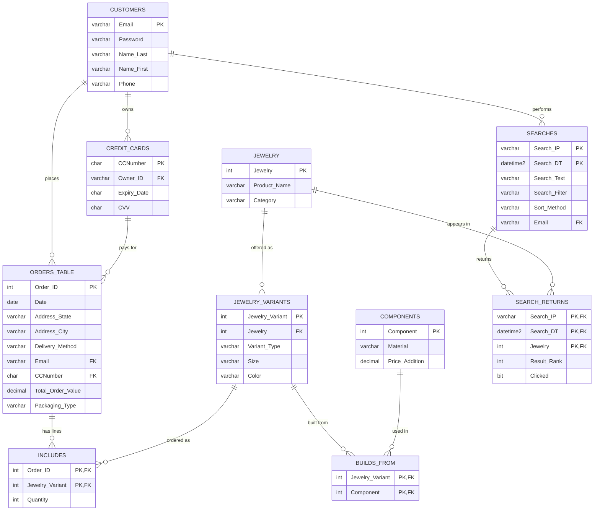
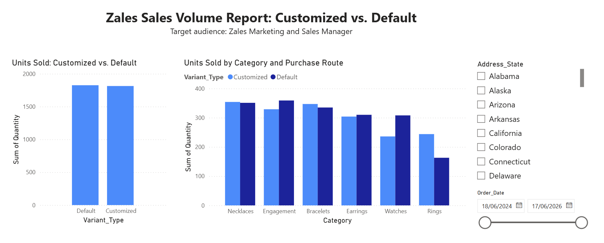

# E-commerce SQL Database (Jewelry Store)

A relational database for an online jewelry store, built in SQL Server as the semester project for a Database Systems course (B.Sc. Industrial Engineering & Management). It was a team project: three students worked on it together.

The scenario is based on the purchase flow of Zales.com, a US jewelry retailer. We studied how the site works (browsing, searching, customizing a piece, checkout) and designed a database that could support that process. The company is only the case study. This is not affiliated with Zales, and all data in the database is synthetic: the names, emails, card numbers and addresses are made up. For this public version, emails use the reserved `example.com` domain, phone numbers use the fictional 555-01xx range, and card numbers start with `0000` and are not valid card numbers.

## What the database models

- **Customers** who place **orders** and pay with **credit cards**
- A **jewelry** catalog, where each item is sold as one or more **variants** (size and color, marked `Default` or `Customized`)
- **Components** (materials such as 14K gold or platinum) that a variant is built from. Each component carries a price addition, and order value is calculated from these.
- **Searches** on the site and the **search results** returned for each search (rank, clicked or not)

## Schema

10 tables, 1,500 orders and about 8,000 rows of synthetic data in total.

| Table | Rows | Primary key | Notes |
|---|---|---|---|
| `CUSTOMERS` | 350 | `Email` | |
| `CREDIT_CARDS` | 450 | `CCNumber` | FK to `CUSTOMERS` |
| `JEWELRY` | 300 | `Jewelry` | catalog item and category |
| `JEWELRY_VARIANTS` | 400 | `Jewelry_Variant` | FK to `JEWELRY`, CHECK on `Variant_Type` |
| `COMPONENTS` | 250 | `Component` | CHECK `Price_Addition >= 0` |
| `ORDERS_TABLE` | 1,500 | `Order_ID` | FKs to `CUSTOMERS` and `CREDIT_CARDS` |
| `INCLUDES` | 1,800 | (`Order_ID`, `Jewelry_Variant`) | order lines, CHECK `Quantity > 0` |
| `BUILDS_FROM` | 1,200 | (`Jewelry_Variant`, `Component`) | many-to-many between variants and components |
| `SEARCHES` | 400 | (`Search_IP`, `Search_DT`) | composite key, FK to `CUSTOMERS` |
| `SEARCH_RETURNS` | 1,500 | (`Search_IP`, `Search_DT`, `Jewelry`) | composite FK to `SEARCHES`, CHECK `Result_Rank BETWEEN 1 AND 20` |

The diagram below was generated from the `CREATE TABLE` statements in `sql/01_create_database_and_load_data.sql`. It only shows the keys and foreign keys defined there.



We also drew our own ERD for the course (`docs/erd_course_submission.png`). The final SQL differs slightly from that drawing: in the SQL, `SEARCH_RETURNS` stores `Result_Rank` and `Clicked`.

## Synthetic data generation

`data-generation/generate_fake_data.py` uses Python, pandas and Faker to create the data. It builds the tables in dependency order: parent tables first, then the tables that reference them. That way every foreign key points to a row that already exists, and the pairs in the link tables are unique. Each table is exported to a CSV file. The row counts (350 customers, 1,500 orders, and so on) are set at the top of the script. Product names are put together from lists of Zales-style collections, stones and styles.

```bash
pip install pandas faker
python data-generation/generate_fake_data.py
```

The script produced the first version of the data, where `SEARCHES` had a simple `Search_ID` key. In the final schema the key is (`Search_IP`, `Search_DT`), and the data was adjusted to match. That conversion step is not part of this script. Running the script again produces a new random dataset, not the exact rows in `sql/01`.

## SQL concepts used

| Concept | Where |
|---|---|
| Primary keys, composite keys, foreign keys, CHECK constraints | `01` – table definitions |
| Multi-table joins, `GROUP BY` / `HAVING` | `02` – Query 1 |
| Nested queries (subquery in `HAVING`, subquery in `FROM`) | `02` – Queries 2a, 2b |
| Window functions (`ROW_NUMBER`, `LAG`, running `SUM ... OVER`) | `02` – Query 3 |
| CTEs (`WITH`, three chained blocks) | `02` – Query 4 |
| View | `01` – `V_ORDER_ANALYSIS` |
| Table-valued function | `03` – `GetStateSalesSummary(@State)` |
| Trigger | `03` – `trg_UpdateOrderValue` on `INCLUDES` |
| Stored procedure | `03` – `sp_SetOrderPackaging(@OrderID)` |
| Query rewrite and output equivalence check (`EXCEPT`) | `04` |

A few examples of what the queries answer:

- **Customer purchase history (window functions):** for every order, the customer's order number, the days since their previous order, and their running lifetime value.
- **High-value customers (CTE):** customers whose average order value is above the store-wide average and whose lifetime value is over $5,000.
- **Keeping order totals current (trigger):** when an order line is inserted, updated or deleted, the trigger recalculates `Total_Order_Value` for the affected orders.
- **Packaging rule (stored procedure):** takes an order ID and sets `Premium Velvet Box` for orders worth $2,000 or more, otherwise `Standard Box`.

## Power BI report

We built a three-page Power BI report comparing units sold for customized and default (off-the-shelf) jewelry, with filters for state and date range. The data is synthetic, so the numbers only show that the report works. They say nothing about the real company.



More pages: [monthly trends](docs/powerbi/02_monthly_trends.png), [category details](docs/powerbi/03_category_details.png).

## Team

This was a three-person team project. My part:

- Built the database in SQL Server: the tables, keys and constraints
- Generated the synthetic data. We had no access to the company's real data, so I wrote a Python script with Cursor (an AI-assisted code editor) to fill the tables with made-up records (`data-generation/generate_fake_data.py`).
- Wrote and ran the analysis queries

The other parts of the project were done by my teammates or together.

## Use of AI tools

The synthetic data generator was written in Cursor (see Team above). The table design and the SQL in this repository were written without AI help, except for two course assignments that required a generative AI tool (a course-provided ChatGPT assistant):

1. Comparing our conceptual ERD with one the tool suggested.
2. Asking the tool to optimize existing queries. We applied one suggestion: replacing `YEAR(Date) = 2024` with a date range, which can be faster, especially when the date column has an index. We then used `EXCEPT` to check that both versions return the same rows. See `sql/04_ai_query_optimization.sql`.

## Repository structure

```
data-generation/
  generate_fake_data.py                  Python script that generated the synthetic data (CSV per table)
sql/
  01_create_database_and_load_data.sql   creates the database, 10 tables, synthetic data, view, function, trigger, procedure
  02_analysis_queries.sql                analysis queries (joins, nested queries, window functions, CTE)
  03_function_trigger_procedure.sql      the function, trigger and procedure as written for the assignment, plus test calls
  04_ai_query_optimization.sql           original vs. rewritten query and the EXCEPT check
docs/
  erd_course_submission.png              ERD drawn for the course
  powerbi/                               screenshots of the Power BI report
```

The SQL comments are mostly in Hebrew (the course language). Lines starting with `-- EN:` are English translations added for this repository.

## How to run

You need SQL Server 2016 SP1 or later (Developer or Express edition) and SQL Server Management Studio or Azure Data Studio.

1. Run `sql/01_create_database_and_load_data.sql`. It drops any existing `zales` database, recreates it, loads the data, and ends with two validation queries. Expected result: 1,814 `Customized` units and 1,826 `Default` units.
2. Run the queries in `sql/02_analysis_queries.sql` one at a time.
3. Optionally run `sql/03_function_trigger_procedure.sql` and `sql/04_ai_query_optimization.sql`. The trigger test in `03` changes order 1.

## Changes made for this repository

The SQL is the team's final submitted script. The only changes were:

- Split the single file into four files, and converted it from UTF-16 to UTF-8 so GitHub can display it
- Masked the synthetic personal data: emails moved to `example.com`, phones to 555-01xx, and card numbers replaced with invalid `0000…` numbers. Keys and relationships are unchanged, and the report totals are the same.
- Added English translation comments (`-- EN:`)
- Fixed one comment line that started with a single `-` (a syntax error)
- In `03`, used `CREATE OR ALTER` and added `GO` separators, because `01` already creates the same objects
